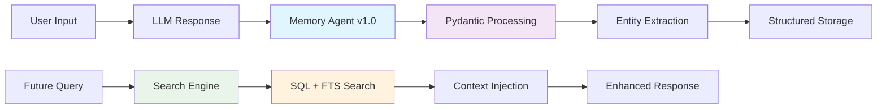

# Memoriai

<div align="center">

**The Open-Source Memory Layer for AI Agents & Multi-Agent Systems v1.0**

*Give your AI agents structured, persistent memory with Pydantic-based intelligence*

[](https://badge.fury.io/py/memoriai)
[](https://opensource.org/licenses/MIT)
[](https://www.python.org/downloads/)
[](https://github.com/yourusername/memoriai/actions)
[](https://discord.gg/memoriai)

[Quick Start](#quick-start) • [Documentation](https://memoriai.readthedocs.io) • [Examples](./examples) • [Contributing](./CONTRIBUTING.md)

</div>

---

## Why Memoriai?

Stop repeating context to your AI agents. **Memoriai v1.0** provides intelligent, structured memory using Pydantic models and OpenAI Structured Outputs for reliable, persistent memory across conversations, sessions, and agents.

```python
# Before Memoriai
response = completion(
    model="gpt-4",
    messages=[
        {"role": "system", "content": "You are a Python expert who prefers clean code..."},
        {"role": "user", "content": "Remember, I'm working on a Flask project..."},
        {"role": "user", "content": "Also, I told you yesterday I use pytest..."},
        {"role": "user", "content": "Now help me with authentication"}
    ]
)

# After Memoriai v1.0
from memoriai import Memori

office_work = Memori(
    database_connect="sqlite:///office_memory.db",
    template="basic",
    conscious_ingest=True,
    openai_api_key="your-api-key"
)
office_work.enable()

response = completion(
    model="gpt-4", 
    messages=[{"role": "user", "content": "Help me with authentication"}]
)
# AI automatically knows your preferences, project context, and history through structured memory
```

---

## Philosophy

**Structured & Reliable**
- Pydantic-based memory processing with OpenAI Structured Outputs
- Connect to any database (SQLite, PostgreSQL, MySQL)
- Works with OpenAI, Anthropic, LiteLLM (100+ models)
- Plug-and-play with existing AI workflows

**Intelligent Memory Layer**
- Persistent memory across sessions and conversations
- Automatic entity extraction (people, technologies, topics, skills, projects)
- Multi-dimensional importance scoring (novelty, relevance, actionability)
- Context-aware retrieval with SQL-based search

**Production-Ready Architecture**
- Pydantic model validation for data integrity
- Full-text search (FTS5) for advanced memory retrieval
- Entity indexing for fast searches
- Comprehensive memory analytics and insights

---

## 🚀 Quick Start

### Installation

```bash
pip install memoriai
```

### Basic Usage

```python
from memoriai import Memori, create_memory_search_tool
import os

# Initialize Memoriai v1.0 with structured processing
office_work = Memori(
    database_connect="sqlite:///my_workspace.db",
    template="basic",
    mem_prompt="Focus on programming concepts and technical discussions",
    conscious_ingest=True,
    namespace="development_workspace",
    openai_api_key=os.getenv("OPENAI_API_KEY")
)

# Enable Pydantic-based memory processing
office_work.enable()

# Your conversations are now automatically remembered
response = completion(
    model="gpt-4",
    messages=[{"role": "user", "content": "Write a Flask API for user authentication"}]
)

print(response.choices[0].message.content)
```

### Personal Assistant Setup

```python
from memoriai import Memori

personal_space = Memori(
    database_connect="sqlite:///personal_assistant.db",
    template="basic",
    mem_prompt="Remember my preferences, habits, and important information",
    conscious_ingest=True,
    namespace="personal_assistant",
    openai_api_key=os.getenv("OPENAI_API_KEY")
)

personal_space.enable()

# Record personal preferences
personal_space.record_conversation(
    user_input="I prefer coffee over tea in the mornings",
    ai_output="I'll remember that you prefer coffee in the mornings!",
    model="gpt-4o"
)

# Your AI now intelligently remembers and categorizes:
# - Personal preferences (automatically detected as 'preference' category)
# - Important facts (categorized as 'fact')
# - Skills and learning (categorized as 'skill') 
# - Rules and constraints (categorized as 'rule')
# - Project contexts (categorized as 'context')

# Search by category
preferences = personal_space.search_memories_by_category("preference", limit=5)
```

---

## How It Works



### The Memoriai v1.0 Workflow

1. **Structured Recording**: Conversations processed through Pydantic models
2. **OpenAI Structured Outputs**: Memory agent uses `gpt-4o` with `response_format=ProcessedMemory`
3. **Entity Extraction**: Automatic extraction of people, technologies, topics, skills, projects
4. **Multi-dimensional Scoring**: Importance, novelty, relevance, and actionability scores
5. **Intelligent Storage**: ProcessedMemory objects stored with entity indexing
6. **Advanced Retrieval**: SQL + FTS5 search with multi-strategy ranking
7. **Context-Aware Responses**: AI responds with structured memory context

---

## Memory Architecture v1.0

### Pydantic-Based Processing

```python
from memoriai.utils.pydantic_models import ProcessedMemory, MemoryCategory, ExtractedEntities

# Example of structured memory processing
processed_memory = ProcessedMemory(
    category=MemoryCategory(
        primary_category=MemoryCategoryType.fact,
        confidence_score=0.9,
        reasoning="This contains factual information about Python"
    ),
    entities=ExtractedEntities(
        technologies=["Python", "Flask"],
        topics=["web development", "authentication"],
        skills=["API development"],
        keywords=["JWT", "security", "endpoints"]
    ),
    importance=MemoryImportance(
        importance_score=0.8,
        retention_type=RetentionType.long_term,
        reasoning="Important technical knowledge for development work"
    ),
    summary="Flask API authentication using JWT tokens",
    searchable_content="Flask API JWT authentication security endpoints development",
    should_store=True
)
```

### Database Schema v1.0

```sql
-- Chat History with full metadata
CREATE TABLE chat_history (
    chat_id TEXT PRIMARY KEY,
    user_input TEXT NOT NULL,
    ai_output TEXT NOT NULL,
    model TEXT NOT NULL,
    timestamp TIMESTAMP NOT NULL,
    session_id TEXT NOT NULL,
    namespace TEXT NOT NULL DEFAULT 'default',
    tokens_used INTEGER DEFAULT 0,
    metadata TEXT DEFAULT '{}'
);

-- Structured Memory Storage
CREATE TABLE long_term_memory (
    memory_id TEXT PRIMARY KEY,
    original_chat_id TEXT,
    processed_data TEXT NOT NULL,  -- Full ProcessedMemory JSON
    importance_score REAL NOT NULL DEFAULT 0.5,
    category_primary TEXT NOT NULL,
    retention_type TEXT NOT NULL DEFAULT 'long_term',
    namespace TEXT NOT NULL DEFAULT 'default',
    created_at TIMESTAMP NOT NULL,
    searchable_content TEXT NOT NULL,
    summary TEXT NOT NULL,
    novelty_score REAL DEFAULT 0.5,
    relevance_score REAL DEFAULT 0.5,
    actionability_score REAL DEFAULT 0.5
);

-- Entity Index for Fast Search
CREATE TABLE memory_entities (
    entity_id TEXT PRIMARY KEY,
    memory_id TEXT NOT NULL,
    memory_type TEXT NOT NULL,
    entity_type TEXT NOT NULL,  -- person, technology, topic, skill, project, keyword
    entity_value TEXT NOT NULL,
    relevance_score REAL NOT NULL DEFAULT 0.5,
    namespace TEXT NOT NULL DEFAULT 'default'
);

-- Full-Text Search Support
CREATE VIRTUAL TABLE memory_search_fts USING fts5(
    memory_id, memory_type, namespace, searchable_content, summary, category_primary
);
```

### Memory Categories v1.0

```python
from memoriai import MemoryCategoryType, RetentionType

class MemoryCategoryType(str, Enum):
    fact = "fact"           # Factual information, definitions, technical details
    preference = "preference"  # User preferences, settings, personal choices
    skill = "skill"         # Skills, abilities, competencies, learning progress
    context = "context"     # Project context, work environment, situations
    rule = "rule"          # Rules, policies, procedures, guidelines

class RetentionType(str, Enum):
    short_term = "short_term"    # 7 days retention
    long_term = "long_term"      # Persistent storage
    permanent = "permanent"      # Never expires
```

---

## Integrations v1.0

### Supported LLM Providers ✅
- **OpenAI** (GPT-3.5, GPT-4, GPT-4o) - Full support with Structured Outputs
- **LiteLLM** (100+ models support) - Auto-recording integration
- **Anthropic** (Claude models) - Auto-recording integration

### Supported Databases ✅  
- **SQLite** (Perfect for development, includes FTS5 support)
- **PostgreSQL** (Production-ready with psycopg2 connector)
- **MySQL** (Wide compatibility with mysql-connector-python)

### Memory Search Features ✅
- **SQL-based Search**: Advanced SQL queries with entity matching
- **FTS5 Full-Text Search**: Fast text search across memory content
- **Entity-based Retrieval**: Search by people, technologies, topics, skills
- **Category Filtering**: Filter by memory categories
- **Importance Ranking**: Prioritize high-importance memories
- **Multi-strategy Search**: Combine keyword, entity, and semantic search

### Framework Integration Examples ✅
- **LiteLLM Example**: `examples/integrations/litellm_example.py`
- **LangChain Example**: `examples/integrations/langchain_example.py`
- **AGNO Framework**: `examples/integrations/agno_example.py`
- **Multi-Agent Systems**: `examples/advanced/multi_agent_memory.py`

---

## Advanced Examples v1.0

### Multi-Agent Memory Systems

```python
from memoriai import Memori, create_memory_search_tool

# Research Agent
research_agent = Memori(
    database_connect="sqlite:///research_agent.db",
    mem_prompt="Focus on research findings and technical information",
    namespace="research_agent",
    openai_api_key=os.getenv("OPENAI_API_KEY")
)

# Planning Agent  
planning_agent = Memori(
    database_connect="sqlite:///planning_agent.db", 
    mem_prompt="Focus on strategies, schedules, and task organization",
    namespace="planning_agent",
    openai_api_key=os.getenv("OPENAI_API_KEY")
)

# Cross-agent information sharing
research_tool = create_memory_search_tool(research_agent)
planning_tool = create_memory_search_tool(planning_agent)

# Agents can search each other's specialized knowledge
research_context = research_tool("quantum computing developments", max_results=3)
planning_context = planning_tool("project timeline strategies", max_results=3)
```

### Entity-Based Memory Search

```python
from memoriai import Memori

memory_system = Memori(
    database_connect="sqlite:///entity_memory.db",
    conscious_ingest=True,
    openai_api_key=os.getenv("OPENAI_API_KEY")
)

memory_system.enable()

# Automatic entity extraction and search
memory_system.record_conversation(
    user_input="I'm working with Python, Flask, and PostgreSQL on my e-commerce project",
    ai_output="Great tech stack! Flask is excellent for rapid development...",
    model="gpt-4o"
)

# Search by specific entities
python_memories = memory_system.get_entity_memories("Python", limit=5)
flask_memories = memory_system.get_entity_memories("Flask", limit=3)

# Search by category
tech_preferences = memory_system.search_memories_by_category("preference", limit=5)
learned_skills = memory_system.search_memories_by_category("skill", limit=5)
```

### Memory Analytics and Insights

```python
# Get comprehensive memory statistics
stats = memory_system.get_memory_stats()

print(f"Memory Analytics:")
print(f"  Total Conversations: {stats.get('chat_history_count', 0)}")
print(f"  Long-term Memories: {stats.get('long_term_count', 0)}")
print(f"  Extracted Entities: {stats.get('total_entities', 0)}")
print(f"  Average Importance: {stats.get('average_importance', 0):.2f}")

# Category breakdown
categories = stats.get('memories_by_category', {})
for category, count in categories.items():
    print(f"  {category}: {count} memories")
```

---

## Development & Testing

### Local Development

```bash
# Clone the repository
git clone https://github.com/yourusername/memoriai.git
cd memoriai

# Setup development environment
python -m venv venv
source venv/bin/activate  # Linux/Mac
pip install -r requirements-dev.txt
pip install -e .

# Run tests
pytest tests/ -v

# Run with coverage
pytest --cov=memoriai --cov-report=html
```

### Docker Support

```bash
# Run with Docker
docker-compose up -d

# Or build custom image
docker build -t memoriai:latest .
docker run -v $(pwd)/data:/app/data memoriai:latest
```

---

## Roadmap

### v1.0.0 - Pydantic Foundation ✅ RELEASED
- [x] Pydantic-based memory processing with OpenAI Structured Outputs
- [x] Advanced entity extraction (people, technologies, topics, skills, projects)
- [x] Multi-dimensional importance scoring (novelty, relevance, actionability)
- [x] SQLite, PostgreSQL, and MySQL support with optimized connectors
- [x] Full-text search (FTS5) and entity indexing
- [x] LiteLLM and Anthropic auto-recording integrations
- [x] Comprehensive memory analytics and search tools
- [x] Multi-agent memory examples and framework integration examples

### v1.1.0 - Enhanced Search & Performance
- [ ] Vector search integration (ChromaDB, Pinecone, Weaviate)
- [ ] Semantic similarity search
- [ ] Memory relationship graph analysis
- [ ] Performance optimizations and caching
- [ ] Memory compression and archiving

### v1.2.0 - Advanced Integrations
- [ ] LangChain native integration
- [ ] AutoGen memory connector
- [ ] CrewAI memory support
- [ ] Semantic Kernel integration
- [ ] Memory import/export tools

### v1.3.0 - Enterprise Features
- [ ] Memory encryption and privacy controls
- [ ] Horizontal scaling with Redis clustering
- [ ] Memory conflict resolution algorithms
- [ ] Advanced memory lifecycle management
- [ ] Memory analytics dashboard

### v2.0.0 - Next Generation
- [ ] Graph-based memory relationships
- [ ] Advanced reasoning and memory synthesis
- [ ] Multi-modal memory (text, images, audio)
- [ ] Federated memory across agents
- [ ] AI-powered memory optimization

---

## Contributing

We welcome contributions from the community! Whether you're fixing bugs, adding features, or improving documentation, every contribution helps make Memori better.

### Quick Contribution Guide

1. **Fork** the repository
2. **Create** a feature branch: `git checkout -b feature/amazing-feature`
3. **Make** your changes following our coding standards
4. **Add** tests for new functionality
5. **Submit** a pull request

See our [Contributing Guide](./CONTRIBUTING.md) for detailed instructions.

### Contributors

<a href="https://github.com/yourusername/memoriai/graphs/contributors">
  
</a>

---

## License

This project is licensed under the MIT License - see the [LICENSE](./LICENSE) file for details.

---

## Acknowledgments

- Inspired by human memory systems and cognitive neuroscience
- Built for the thriving AI agent community
- Special thanks to early adopters and contributors

---

<div align="center">

**If Memori helps your AI agents remember better, give us a star!**

[Back to Top](#memori)

Made with care by the Memori Team

</div>