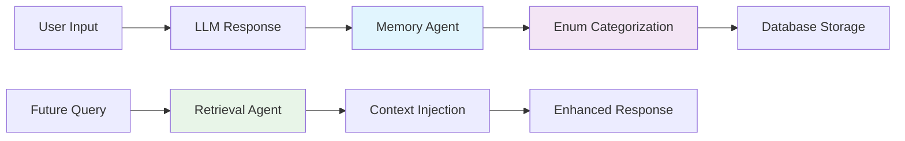

# Memori

<div align="center">

**The Open-Source Memory Layer for AI Agents & Multi-Agent Systems**

*Give your AI agents human-like memory that never forgets*

[](https://badge.fury.io/py/memoriai)
[](https://opensource.org/licenses/MIT)
[](https://www.python.org/downloads/)
[](https://github.com/yourusername/memoriai/actions)
[](https://discord.gg/memoriai)

[Quick Start](#quick-start) • [Documentation](https://memoriai.readthedocs.io) • [Examples](./examples) • [Contributing](./CONTRIBUTING.md)

</div>

---

## Why Memori?

Stop repeating context to your AI agents. **Memori** provides persistent, categorized memory that works across conversations, sessions, and even different agents.

```python
# Before Memori
response = completion(
    model="gpt-4",
    messages=[
        {"role": "system", "content": "You are a Python expert who prefers clean code..."},
        {"role": "user", "content": "Remember, I'm working on a Flask project..."},
        {"role": "user", "content": "Also, I told you yesterday I use pytest..."},
        {"role": "user", "content": "Now help me with authentication"}
    ]
)

# After Memori
office_work = Memori(template="basic", conscious_ingest=True)
office_work.enable()

response = completion(
    model="gpt-4", 
    messages=[{"role": "user", "content": "Help me with authentication"}]
)
# AI automatically knows your preferences, project context, and history
```

---

## Philosophy

**Flexible & Universal**
- Connect to any database (SQLite, PostgreSQL, MySQL)
- Works with any LLM (OpenAI, Anthropic, open-source models)
- Plug-and-play with existing AI workflows

**Second Brain for AI**
- Long-term memory support across sessions
- No more context repetition
- Persistent learning and adaptation

**Intelligent Memory Management**
- Enum-driven categorization (lightning-fast, cost-effective)
- Conscious ingestion of relevant context
- Automatic memory organization and retrieval

---

## 🚀 Quick Start

### Installation

```bash
pip install memoriai
```

### Basic Usage

```python
from memoriai import Memori
from litellm import completion
import os

# Initialize your AI memory
office_work = Memori(
    database_connect="sqlite:///my_workspace.db",
    template="basic",
    mem_prompt="Only record {python} related conversations",
    conscious_ingest=True
)

# Enable memory recording (works like loguru)
office_work.enable()

# Your conversations are now automatically remembered
response = completion(
    model="gpt-4",
    messages=[{"role": "user", "content": "Write a Flask API for user authentication"}]
)

print(response.choices[0].message.content)
```

### Personal Assistant Setup

```python
from memoriai import Memori

personal_space = Memori(
    database_connect="sqlite:///personal_assistant.db",
    template="basic",
    mem_prompt="Remember my preferences, habits, and important information",
    conscious_ingest=True
)

personal_space.enable()

# Now your AI remembers:
# - Your coding preferences
# - Project contexts
# - Personal information you've shared
# - Previous conversations and decisions
```

---

## How It Works



### The Memory Workflow

1. **Automatic Recording**: Every interaction gets logged
2. **Smart Categorization**: Memory agent uses enum-driven classification
3. **Intelligent Storage**: Information stored in appropriate memory tables
4. **Context-Aware Retrieval**: Future queries automatically get relevant context
5. **Enhanced Responses**: AI responds with full historical awareness

---

## Memory Architecture

### Database Schema Templates

#### Basic Template
```yaml
chat_history:
  - chat_id: UUID
  - user_input: TEXT
  - ai_output: TEXT
  - model: STRING
  - timestamp: DATETIME
  - tokens_used: INTEGER

short_term_memory:
  - memory_id: UUID
  - chat_id: UUID
  - content: TEXT
  - category: ENUM
  - importance_score: FLOAT
  - expires_at: DATETIME

long_term_memory:
  - memory_id: UUID
  - content: TEXT
  - category: ENUM
  - access_count: INTEGER
  - last_accessed: DATETIME
  - created_at: DATETIME

rules_memory:
  - rule_id: UUID
  - rule_type: ENUM
  - condition: TEXT
  - action: TEXT
  - priority: INTEGER
  - active: BOOLEAN
```

### Enum-Driven Intelligence

```python
from enum import Enum

class MemoryCategory(Enum):
    STORE_AS_FACT = "fact"           # Factual information to remember
    UPDATE_PREFERENCE = "preference"  # User preferences and settings
    DISCARD_TRIVIAL = "discard"      # Unimportant, temporary information
    STORE_AS_RULE = "rule"           # Behavioral rules and constraints
    STORE_AS_CONTEXT = "context"     # Project or domain context
```

---

## Integrations

### Supported LLM Providers
- **OpenAI** (GPT-3.5, GPT-4, GPT-4 Turbo)
- **LiteLLM** (100+ models support)
- **Anthropic** (Claude models)
- **Local Models** (Ollama, LM Studio) - Coming Soon
- **Azure OpenAI** - Coming Soon

### Supported Databases
- **SQLite** (Perfect for development and personal use)
- **PostgreSQL** (Production-ready, scalable)
- **MySQL** (Wide compatibility)
- **MongoDB** - Coming Soon
- **Redis** - Coming Soon

### Framework Integrations
- **LangChain** - Coming Soon
- **AutoGen** - Coming Soon  
- **CrewAI** - Coming Soon
- **Semantic Kernel** - Coming Soon

---

## Advanced Examples

### Multi-Agent Memory Sharing

```python
# Shared memory for team of agents
team_memory = Memori(
    database_connect="postgresql://localhost/team_memory",
    template="advanced",
    shared_memory=True,
    namespace="development_team"
)

# Agent 1: Code Reviewer
code_reviewer = Agent(memory=team_memory, role="reviewer")

# Agent 2: Documentation Writer  
doc_writer = Agent(memory=team_memory, role="documentation")

# They share collective memory of the project
```

### Custom Memory Templates

```python
# Create custom memory schema for specialized use cases
custom_memory = Memori(
    database_connect="sqlite:///research.db",
    template="research",  # Custom template
    mem_prompt="Focus on research papers, methodologies, and findings",
    conscious_ingest=True,
    custom_categories=[
        "RESEARCH_PAPER",
        "METHODOLOGY", 
        "FINDING",
        "HYPOTHESIS"
    ]
)
```

### Conscious Ingestion Control

```python
# Fine-tune what gets remembered
selective_memory = Memori(
    database_connect="sqlite:///selective.db",
    template="basic",
    mem_prompt="Only remember coding solutions and bug fixes",
    conscious_ingest=True,
    memory_filters={
        "include_keywords": ["error", "bug", "solution", "fix"],
        "exclude_keywords": ["weather", "joke", "random"],
        "min_importance": 0.7
    }
)
```

---

## Development & Testing

### Local Development

```bash
# Clone the repository
git clone https://github.com/yourusername/memoriai.git
cd memoriai

# Setup development environment
python -m venv venv
source venv/bin/activate  # Linux/Mac
pip install -r requirements-dev.txt
pip install -e .

# Run tests
pytest tests/ -v

# Run with coverage
pytest --cov=memoriai --cov-report=html
```

### Docker Support

```bash
# Run with Docker
docker-compose up -d

# Or build custom image
docker build -t memoriai:latest .
docker run -v $(pwd)/data:/app/data memoriai:latest
```

---

## Roadmap

### v0.1.0 - Core Foundation
- [x] Basic memory storage and retrieval
- [x] SQLite support
- [x] OpenAI integration
- [x] Enum-driven categorization

### v0.2.0 - Enhanced Features
- [ ] PostgreSQL and MySQL support
- [ ] LiteLLM integration
- [ ] Custom memory templates
- [ ] Memory search and filtering

### v0.3.0 - Advanced Capabilities
- [ ] Multi-agent memory sharing
- [ ] Memory conflict resolution
- [ ] Advanced retrieval algorithms
- [ ] Memory analytics dashboard

### v1.0.0 - Production Ready
- [ ] Enterprise security features
- [ ] Horizontal scaling support
- [ ] Framework integrations
- [ ] Comprehensive documentation

---

## Contributing

We welcome contributions from the community! Whether you're fixing bugs, adding features, or improving documentation, every contribution helps make Memori better.

### Quick Contribution Guide

1. **Fork** the repository
2. **Create** a feature branch: `git checkout -b feature/amazing-feature`
3. **Make** your changes following our coding standards
4. **Add** tests for new functionality
5. **Submit** a pull request

See our [Contributing Guide](./CONTRIBUTING.md) for detailed instructions.

### Contributors

<a href="https://github.com/yourusername/memoriai/graphs/contributors">
  
</a>

---

## License

This project is licensed under the MIT License - see the [LICENSE](./LICENSE) file for details.

---

## Acknowledgments

- Inspired by human memory systems and cognitive neuroscience
- Built for the thriving AI agent community
- Special thanks to early adopters and contributors

---

<div align="center">

**If Memori helps your AI agents remember better, give us a star!**

[Back to Top](#memori)

Made with care by the Memori Team

</div>