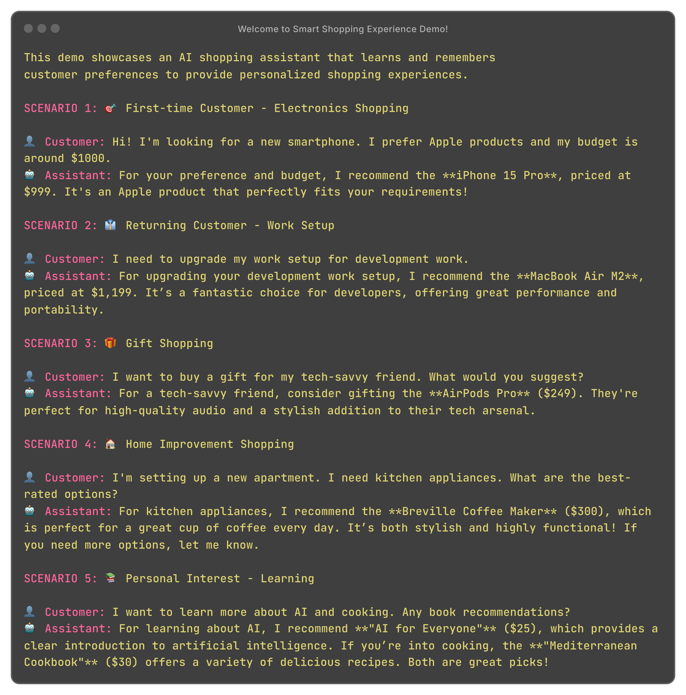

# Smart Shopping Experience Demo

An AI-powered shopping assistant using Azure AI Foundry + Memori integration.



## 🎯 Demo Overview

This demo showcases an intelligent shopping assistant that:

- **Learns Customer Preferences**: Remembers past purchases and preferences
- **Provides Personalized Recommendations**: Suggests products based on shopping history
- **Budget-Aware Shopping**: Considers customer budget constraints
- **Cross-Category Intelligence**: Connects purchases across different product categories
- **Gift Recommendations**: Suggests gifts based on customer's taste and history
- **Contextual Conversations**: Maintains shopping context across interactions

## 🛍️ Demo Scenarios

### Scenario 1: First-time Customer - Electronics Shopping
- Customer shows interest in Apple products with $1000 budget
- Assistant learns preference for high-quality tech products
- Recommends iPhone 15 Pro and complementary accessories

### Scenario 2: Returning Customer - Work Setup
- Customer returns for laptop after previous phone purchase
- Assistant remembers tech preferences and suggests MacBook Air M2
- Recommends video call accessories based on work needs

### Scenario 3: Gift Shopping
- Customer seeks gift recommendations for tech-savvy friend
- Assistant uses purchase history to suggest appropriate gifts
- Provides budget-conscious options for home office setup

### Scenario 4: Home Improvement Shopping
- Customer needs kitchen and cleaning appliances
- Assistant recommends best-rated options across categories
- Suggests bedroom items within reasonable price range

### Scenario 5: Personal Interest - Learning
- Customer expands interests from tech to books
- Assistant suggests AI and cooking books based on profile
- Provides complementary purchase suggestions

## 🧠 Memory Capabilities

The assistant demonstrates advanced memory features:

- **Purchase History Tracking**: Remembers all past purchases
- **Preference Learning**: Adapts to customer taste and budget
- **Relationship Mapping**: Connects related products and categories
- **Seasonal Awareness**: Considers timing for recommendations
- **Gift Intelligence**: Suggests appropriate gifts based on relationships

## 📦 Product Catalog

The demo includes a mock product catalog with:
- **Electronics**: Smartphones, laptops, tablets, audio devices
- **Clothing**: Shoes, jeans, sweaters
- **Home**: Kitchen appliances, cleaning tools, bedroom items
- **Books**: Technology and cooking topics

Each product includes:
- Price information
- Customer ratings
- Category classification
- Product specifications

## 🚀 Running the Demo

### Prerequisites

1. **Install Dependencies**:
```bash
pip install memorisdk azure-ai-projects azure-identity python-dotenv
```

2. **Set Environment Variables**:
Create a `.env` file or set the following environment variables:

```bash
# Azure AI Foundry Project Configuration
export PROJECT_ENDPOINT="https://your-project.eastus2.ai.azure.com"

# Azure OpenAI Configuration
export AZURE_OPENAI_API_KEY="your-azure-openai-api-key-here"
export AZURE_OPENAI_ENDPOINT="https://your-resource.openai.azure.com/"
export AZURE_OPENAI_DEPLOYMENT_NAME="gpt-4o"
export AZURE_OPENAI_API_VERSION="2024-12-01-preview"
```

### Example .env File

```env
PROJECT_ENDPOINT=https://your-project.eastus2.ai.azure.com
AZURE_OPENAI_API_KEY=your-azure-openai-api-key-here
AZURE_OPENAI_ENDPOINT=https://your-resource.openai.azure.com/
AZURE_OPENAI_DEPLOYMENT_NAME=gpt-4o
AZURE_OPENAI_API_VERSION=2024-12-01-preview
```

3. **Configure Azure Authentication**:
```bash
# Login to Azure CLI
az login

# Or set up managed identity for production environments
```

4. **Run the Demo**:
```bash
python smart_shopping_demo.py
```

## 📊 Demo Features

### Predefined Interactions
- No user input required - fully automated scenarios
- Realistic shopping conversations
- Progressive relationship building
- Memory-driven personalization

### Real-world Functions
- **search_memory()**: Search shopping history and preferences
- **search_products()**: Find products by category with filters
- **get_product_details()**: Get detailed product information

### Business Intelligence
- Customer preference analysis
- Purchase pattern recognition
- Budget-aware recommendations
- Cross-selling opportunities

## 💾 Memory Persistence

All interactions are stored in:
- **Database**: `sqlite:///smart_shopping_memory.db`
- **Namespace**: `smart_shopping_assistant`
- **Conversations**: Full context preservation
- **Preferences**: Learned customer traits

## 🎨 Output Format

The demo provides:
- Clear scenario separation
- Realistic conversation flow
- Progress indicators
- Performance metrics
- Memory insights

## 🔧 Customization

Easily customize:
- Product catalog expansion
- New shopping scenarios
- Additional customer functions
- Memory search parameters
- Recommendation algorithms

## 📈 Business Applications

This demo pattern applies to:
- E-commerce platforms
- Personal shopping assistants
- Customer service chatbots
- Product recommendation engines
- Loyalty program systems

## 🏆 Success Metrics

The demo tracks:
- Conversation completions
- Memory utilization
- Function call success
- Customer satisfaction patterns
- Recommendation accuracy

Perfect for demonstrating enterprise AI capabilities in retail and customer experience applications!
