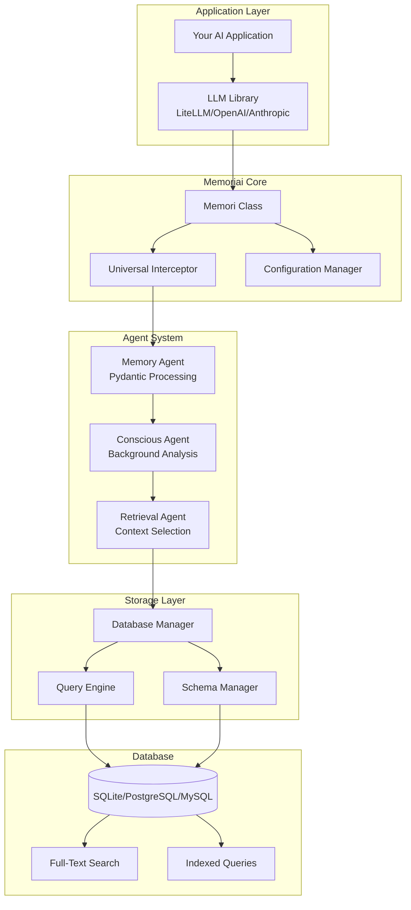
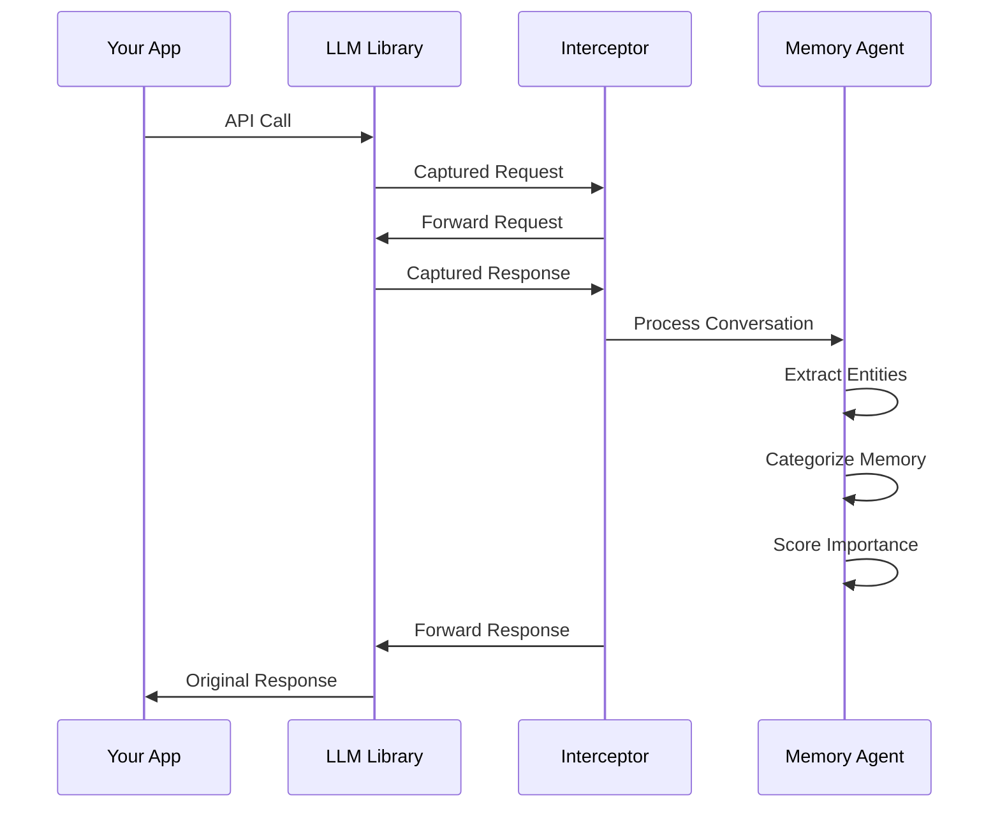
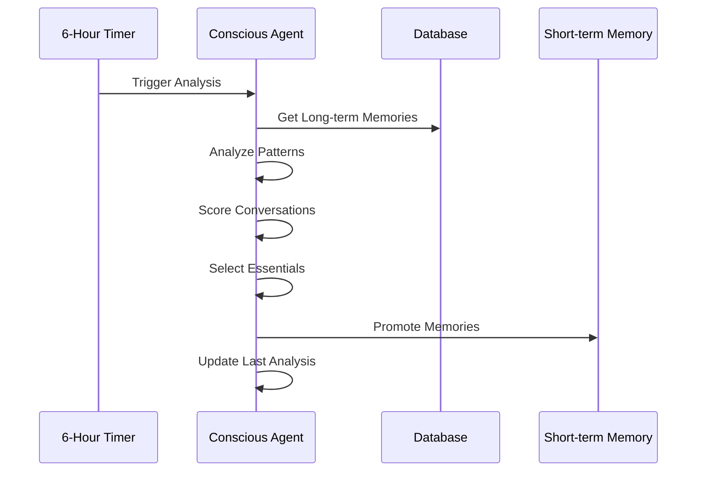
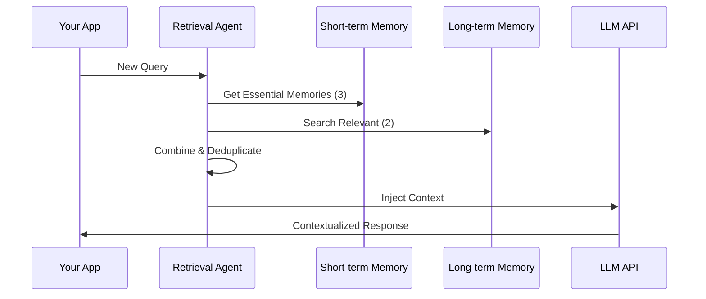

# Architecture Overview

Memoriai is built with a modular, production-ready architecture designed for reliability, performance, and extensibility.

## System Architecture



## Core Components

### 1. Memori Class (Entry Point)
The main interface that users interact with:

```python
class Memori:
    def __init__(self, database_connect, conscious_ingest=True, ...):
        # Initialize all subsystems
    
    def enable(self):
        # Start universal recording
    
    def disable(self):
        # Stop recording and cleanup
```

**Responsibilities:**
- Configuration management
- Component initialization
- Lifecycle management
- Public API surface

### 2. Universal Interceptor
Automatically captures conversations from any LLM library:

```python
class UniversalInterceptor:
    def install_hooks(self):
        # Monkey-patch LLM libraries
    
    def capture_conversation(self, request, response):
        # Extract and process conversations
```

**How it works:**
- Dynamically patches LLM library imports
- Intercepts API calls at the module level
- Extracts conversation data without breaking functionality
- Supports LiteLLM, OpenAI, Anthropic out of the box

### 3. Agent System
Three specialized AI agents for intelligent memory processing:

#### Memory Agent
```python
class MemoryAgent:
    def process_conversation(self, user_input, ai_output):
        # Use OpenAI Structured Outputs
        return ProcessedMemory(
            category=...,
            entities=...,
            importance=...,
            summary=...
        )
```

#### Conscious Agent
```python
class ConsciouscAgent:
    def analyze_patterns(self):
        # Every 6 hours, analyze memory patterns
        # Promote essential conversations
        return EssentialMemoriesAnalysis(
            essential_memories=[...],
            analysis_reasoning="..."
        )
```

#### Retrieval Agent
```python
class RetrievalAgent:
    def plan_search(self, query):
        # Understand query intent
        # Plan search strategy
        return MemorySearchQuery(
            search_terms=[...],
            categories=[...],
            strategy="semantic"
        )
```

### 4. Database Layer
Multi-database support with intelligent querying:

```python
class DatabaseManager:
    def __init__(self, connection_string):
        # Support SQLite, PostgreSQL, MySQL
    
    def initialize_schema(self):
        # Create tables, indexes, FTS
    
    def store_memory(self, processed_memory):
        # Store with relationships
    
    def search_memories(self, query):
        # Full-text search with ranking
```

## Data Flow

### 1. Conversation Capture


### 2. Background Analysis


### 3. Context Injection


## Database Schema

### Core Tables
```sql
-- All conversations
CREATE TABLE chat_history (
    id TEXT PRIMARY KEY,
    user_input TEXT,
    ai_output TEXT,
    model TEXT,
    timestamp DATETIME,
    session_id TEXT,
    namespace TEXT,
    metadata JSON
);

-- Short-term memory (promoted essentials)
CREATE TABLE short_term_memory (
    id TEXT PRIMARY KEY,
    conversation_id TEXT,
    category TEXT,
    importance_score REAL,
    frequency_score REAL,
    recency_score REAL,
    summary TEXT,
    searchable_content TEXT,
    expires_at DATETIME,
    FOREIGN KEY (conversation_id) REFERENCES chat_history(id)
);

-- Long-term memory (all processed memories)
CREATE TABLE long_term_memory (
    id TEXT PRIMARY KEY,
    conversation_id TEXT,
    category TEXT,
    subcategory TEXT,
    retention_type TEXT,
    importance_score REAL,
    summary TEXT,
    searchable_content TEXT,
    reasoning TEXT,
    timestamp DATETIME,
    namespace TEXT,
    FOREIGN KEY (conversation_id) REFERENCES chat_history(id)
);

-- Extracted entities
CREATE TABLE memory_entities (
    id TEXT PRIMARY KEY,
    memory_id TEXT,
    entity_type TEXT,
    entity_value TEXT,
    confidence REAL,
    FOREIGN KEY (memory_id) REFERENCES long_term_memory(id)
);

-- Entity relationships
CREATE TABLE memory_relationships (
    id TEXT PRIMARY KEY,
    from_entity_id TEXT,
    to_entity_id TEXT,
    relationship_type TEXT,
    strength REAL,
    FOREIGN KEY (from_entity_id) REFERENCES memory_entities(id),
    FOREIGN KEY (to_entity_id) REFERENCES memory_entities(id)
);
```

### Indexes for Performance
```sql
-- Full-text search
CREATE VIRTUAL TABLE memory_fts USING fts5(
    content,
    summary,
    entities,
    content='long_term_memory',
    content_rowid='rowid'
);

-- Query optimization indexes
CREATE INDEX idx_memory_category ON long_term_memory(category, namespace);
CREATE INDEX idx_memory_importance ON long_term_memory(importance_score DESC);
CREATE INDEX idx_memory_timestamp ON long_term_memory(timestamp DESC);
CREATE INDEX idx_entities_type ON memory_entities(entity_type, entity_value);
```

## Configuration Architecture

### Layered Configuration
```python
# 1. Default settings
class DefaultSettings:
    database = DatabaseSettings(
        connection_string="sqlite:///memori.db"
    )
    agents = AgentSettings(
        conscious_ingest=True
    )

# 2. File-based configuration (memori.json)
{
    "database": {
        "connection_string": "postgresql://..."
    },
    "agents": {
        "openai_api_key": "sk-..."
    }
}

# 3. Environment variables
MEMORI_DATABASE_CONNECTION_STRING=postgresql://...
MEMORI_AGENTS_OPENAI_API_KEY=sk-...

# 4. Direct parameters
memori = Memori(
    database_connect="postgresql://...",
    conscious_ingest=True
)
```

### Configuration Priority
1. Direct parameters (highest)
2. Environment variables
3. Configuration files
4. Default settings (lowest)

## Error Handling & Resilience

### Graceful Degradation
```python
class MemoriError(Exception):
    """Base exception with context"""
    
    def __init__(self, message, context=None, cause=None):
        self.context = context or {}
        self.cause = cause
        super().__init__(message)

# Component-specific error handling
try:
    conscious_agent.analyze_patterns()
except Exception as e:
    logger.warning(f"Conscious analysis failed: {e}")
    # Continue without analysis
```

### Recovery Strategies
- **Database Connection Loss**: Automatic reconnection with exponential backoff
- **API Rate Limits**: Graceful degradation, queue requests
- **Agent Failures**: Continue core functionality without advanced features
- **Memory Corruption**: Automatic schema validation and repair

## Performance Optimizations

### Database Optimizations
- **Connection Pooling**: Reuse database connections
- **Prepared Statements**: Avoid SQL injection and improve performance
- **Batch Operations**: Group multiple operations for efficiency
- **Index Strategy**: Optimize for common query patterns

### Memory Management
- **Lazy Loading**: Load data only when needed
- **Memory Limits**: Prevent excessive memory usage
- **Cleanup Routines**: Automatic cleanup of expired data
- **Compression**: Compress old memories to save space

### Token Optimization
```python
# Traditional approach
context = get_all_conversation_history()  # 2000+ tokens

# Memoriai approach
essential = get_essential_memories(limit=3)    # 150 tokens
relevant = get_relevant_memories(limit=2)      # 100 tokens
context = essential + relevant                 # 250 tokens total
```

## Security Considerations

### Data Protection
- **API Key Management**: Secure storage and rotation
- **Input Sanitization**: Prevent injection attacks
- **Data Encryption**: Encrypt sensitive data at rest
- **Access Control**: Namespace-based isolation

### Privacy Features
- **Data Retention**: Configurable retention policies
- **Data Deletion**: Secure deletion of expired memories
- **Anonymization**: Option to anonymize stored conversations
- **Audit Logging**: Track access to sensitive memories

## Extensibility Points

### Custom Agents
```python
class CustomAgent(BaseAgent):
    def process_memory(self, conversation):
        # Custom processing logic
        return CustomProcessedMemory(...)
```

### Database Adapters
```python
class CustomDatabaseAdapter(BaseDatabaseAdapter):
    def store_memory(self, memory):
        # Custom storage logic
```

### Integration Hooks
```python
class CustomIntegration(BaseIntegration):
    def capture_conversation(self, request, response):
        # Custom capture logic
```

## Monitoring & Observability

### Metrics Collection
- **Conversation Volume**: Track processing throughput
- **Memory Growth**: Monitor database size and growth
- **Agent Performance**: Track analysis success rates
- **Context Effectiveness**: Measure context injection impact

### Logging Strategy
```python
# Structured logging with context
logger.info(
    "Memory stored",
    extra={
        "memory_id": memory.id,
        "category": memory.category,
        "importance": memory.importance_score,
        "namespace": memory.namespace
    }
)
```

### Health Checks
```python
def health_check():
    return {
        "database": check_database_connection(),
        "agents": check_agent_availability(),
        "memory_stats": get_memory_statistics()
    }
```

This architecture ensures Memoriai can scale from simple personal projects to enterprise-grade AI applications while maintaining reliability and performance.