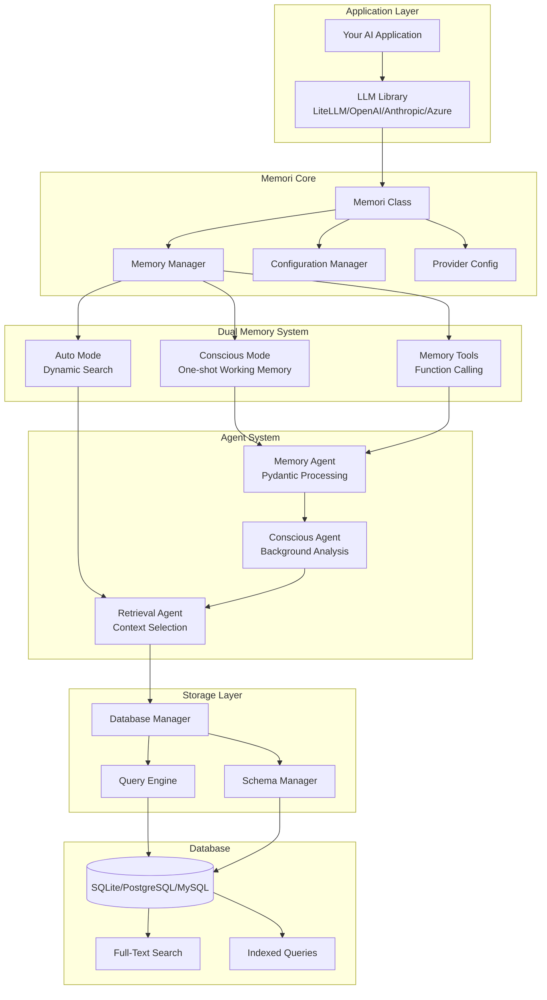
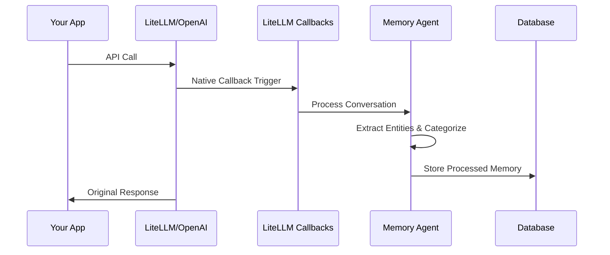
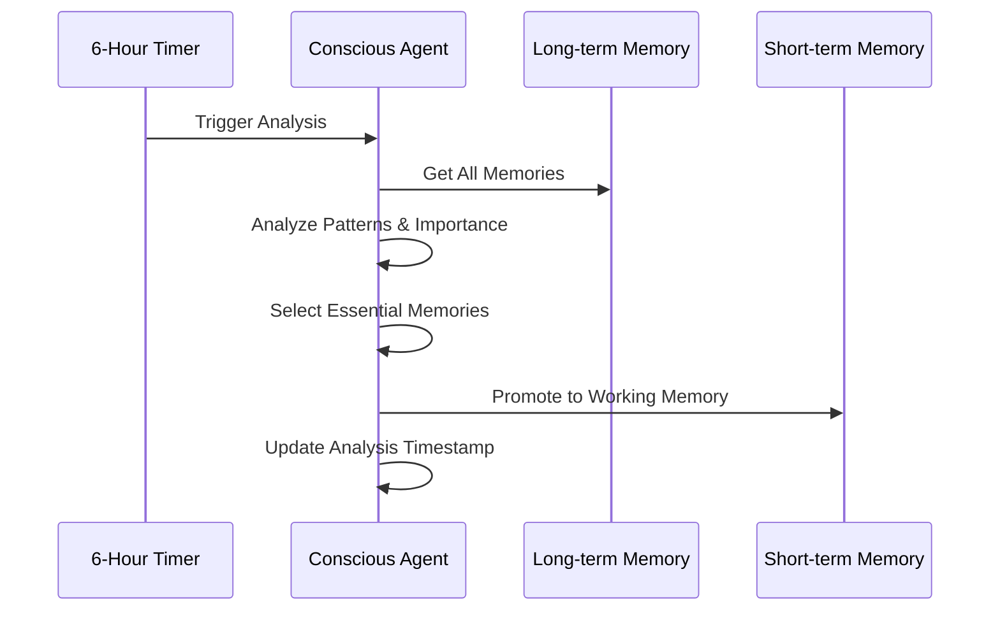
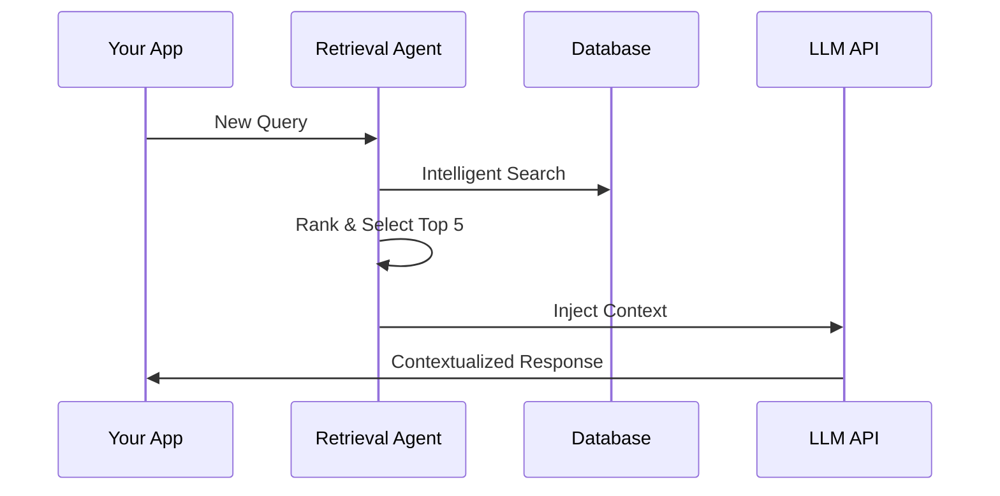
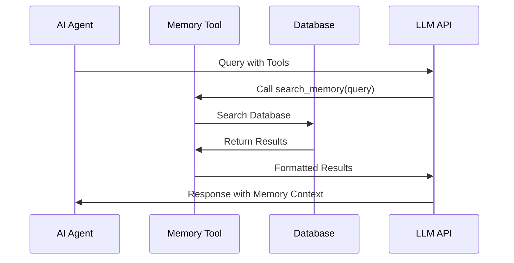

# Architecture Overview

Memori v1.1 is built with a modular, production-ready architecture designed for reliability, performance, and extensibility with dual memory modes and intelligent context injection.

## System Architecture



## Core Components

### 1. Memori Class (Entry Point)
The main interface that users interact with:

```python
class Memori:
    def __init__(self, 
                 database_connect, 
                 conscious_ingest=True, 
                 auto_ingest=False,
                 provider_config=None,
                 ...):
        # Initialize all subsystems
    
    def enable(self):
        # Start universal recording using LiteLLM callbacks
    
    def disable(self):
        # Stop recording and cleanup
        
    def trigger_conscious_analysis(self):
        # Manually trigger background analysis
```

**Responsibilities:**
- Configuration management through ConfigManager
- Component initialization with provider support
- Lifecycle management for both memory modes
- Public API surface with memory tools

### 2. Memory Manager & LiteLLM Integration
Native integration with LiteLLM's callback system:

```python
class MemoryManager:
    def enable(self, interceptors=None):
        # Use LiteLLM native callbacks for universal recording
    
    def record_conversation(self, user_input, ai_output, model):
        # Process and store conversations automatically
```

**How it works:**
- Uses LiteLLM's native callback system for universal recording
- Supports OpenAI, Anthropic, Azure OpenAI, and 100+ providers
- Automatic conversation extraction without monkey-patching
- Provider configuration support for Azure and custom endpoints

### 3. Dual Memory System
Two complementary memory modes for different use cases:

#### Conscious Ingest Mode
```python
class ConsciouscMode:
    def __init__(self, conscious_ingest=True):
        # One-shot working memory injection
        
    def inject_context(self, messages):
        # Inject essential memories once per session
        # Like human short-term memory
```

#### Auto Ingest Mode
```python
class AutoIngestMode:
    def __init__(self, auto_ingest=True):
        # Dynamic memory search per query
        
    def get_context(self, user_input):
        # Search entire database for relevant memories
        # Inject 3-5 most relevant memories per call
```

### 4. Agent System
Three specialized AI agents for intelligent memory processing:

#### Memory Agent
```python
class MemoryAgent:
    def process_conversation(self, user_input, ai_output):
        # Use OpenAI Structured Outputs with Pydantic
        return ProcessedMemory(
            category=...,
            entities=...,
            importance=...,
            summary=...
        )
```

#### Conscious Agent
```python
class ConsciouscAgent:
    def analyze_patterns(self):
        # Every 6 hours, analyze memory patterns
        # Promote essential conversations to working memory
        return EssentialMemoriesAnalysis(
            essential_memories=[...],
            analysis_reasoning="..."
        )
        
    def run_conscious_ingest(self, db_manager, namespace):
        # Background analysis for memory promotion
```

#### Retrieval Agent
```python
class RetrievalAgent:
    def execute_search(self, query, db_manager, namespace, limit=5):
        # Intelligent database search for auto-ingest mode
        # Understand query intent and find relevant memories
        return RelevantMemories(
            memories=[...],
            search_strategy="semantic",
            relevance_scores=[...]
        )
```

### 5. Provider Configuration System
Support for multiple LLM providers with unified configuration:

```python
class ProviderConfig:
    @classmethod
    def from_azure(cls, api_key, azure_endpoint, azure_deployment, ...):
        # Azure OpenAI configuration
        
    @classmethod
    def from_openai(cls, api_key, organization=None, ...):
        # Standard OpenAI configuration
        
    @classmethod
    def from_custom(cls, base_url, api_key, model):
        # Custom endpoint configuration (Ollama, etc.)
        
    def create_client(self):
        # Create configured OpenAI-compatible client
```

### 6. Memory Tools System
Function calling integration for AI agents:

```python
from memori import create_memory_tool

def setup_memory_tools(memori_instance):
    # Create memory search tool for function calling
    memory_tool = create_memory_tool(memori_instance)
    
    return {
        "type": "function",
        "function": {
            "name": "search_memory",
            "description": "Search memory for relevant past conversations",
            "parameters": {...}
        }
    }
```

### 7. Database Layer
Multi-database support with intelligent querying:

```python
class DatabaseManager:
    def __init__(self, connection_string):
        # Support SQLite, PostgreSQL, MySQL
        # Cloud databases: Neon, Supabase, GibsonAI
    
    def initialize_schema(self):
        # Create tables, indexes, FTS
    
    def store_memory(self, processed_memory):
        # Store with relationships and full-text indexing
    
    def search_memories(self, query, namespace, limit=5):
        # Full-text search with ranking and namespace isolation
```

## Data Flow

### 1. Conversation Capture (LiteLLM Native)


### 2. Conscious Mode: Background Analysis & Promotion


### 3. Auto Mode: Dynamic Context Retrieval


### 4. Memory Tools: Function Calling


## Database Schema

### Core Tables
```sql
-- All conversations
CREATE TABLE chat_history (
    id TEXT PRIMARY KEY,
    user_input TEXT,
    ai_output TEXT,
    model TEXT,
    timestamp DATETIME,
    session_id TEXT,
    namespace TEXT,
    metadata JSON
);

-- Short-term memory (promoted essentials)
CREATE TABLE short_term_memory (
    id TEXT PRIMARY KEY,
    conversation_id TEXT,
    category TEXT,
    importance_score REAL,
    frequency_score REAL,
    recency_score REAL,
    summary TEXT,
    searchable_content TEXT,
    expires_at DATETIME,
    FOREIGN KEY (conversation_id) REFERENCES chat_history(id)
);

-- Long-term memory (all processed memories)
CREATE TABLE long_term_memory (
    id TEXT PRIMARY KEY,
    conversation_id TEXT,
    category TEXT,
    subcategory TEXT,
    retention_type TEXT,
    importance_score REAL,
    summary TEXT,
    searchable_content TEXT,
    reasoning TEXT,
    timestamp DATETIME,
    namespace TEXT,
    FOREIGN KEY (conversation_id) REFERENCES chat_history(id)
);

-- Extracted entities
CREATE TABLE memory_entities (
    id TEXT PRIMARY KEY,
    memory_id TEXT,
    entity_type TEXT,
    entity_value TEXT,
    confidence REAL,
    FOREIGN KEY (memory_id) REFERENCES long_term_memory(id)
);

-- Entity relationships
CREATE TABLE memory_relationships (
    id TEXT PRIMARY KEY,
    from_entity_id TEXT,
    to_entity_id TEXT,
    relationship_type TEXT,
    strength REAL,
    FOREIGN KEY (from_entity_id) REFERENCES memory_entities(id),
    FOREIGN KEY (to_entity_id) REFERENCES memory_entities(id)
);
```

### Indexes for Performance
```sql
-- Full-text search
CREATE VIRTUAL TABLE memory_fts USING fts5(
    content,
    summary,
    entities,
    content='long_term_memory',
    content_rowid='rowid'
);

-- Query optimization indexes
CREATE INDEX idx_memory_category ON long_term_memory(category, namespace);
CREATE INDEX idx_memory_importance ON long_term_memory(importance_score DESC);
CREATE INDEX idx_memory_timestamp ON long_term_memory(timestamp DESC);
CREATE INDEX idx_entities_type ON memory_entities(entity_type, entity_value);
```

## Configuration Architecture

### Layered Configuration with ConfigManager
```python
# 1. Default settings from Pydantic models
class MemoriSettings(BaseModel):
    database: DatabaseSettings = DatabaseSettings()
    agents: AgentSettings = AgentSettings()
    memory: MemorySettings = MemorySettings()
    logging: LoggingSettings = LoggingSettings()
    integrations: IntegrationSettings = IntegrationSettings()

# 2. File-based configuration (memori.json)
{
    "database": {
        "connection_string": "postgresql://...",
        "pool_size": 20
    },
    "agents": {
        "openai_api_key": "sk-...",
        "default_model": "gpt-4o-mini"
    },
    "memory": {
        "namespace": "production",
        "retention_policy": "30_days"
    }
}

# 3. Environment variables with nested support
MEMORI_DATABASE__CONNECTION_STRING=postgresql://...
MEMORI_AGENTS__OPENAI_API_KEY=sk-...
MEMORI_MEMORY__NAMESPACE=production

# 4. Direct parameters with provider config
from memori.core.providers import ProviderConfig

azure_provider = ProviderConfig.from_azure(...)
memori = Memori(
    database_connect="postgresql://...",
    conscious_ingest=True,
    auto_ingest=True,
    provider_config=azure_provider
)
```

### Configuration Priority (Highest to Lowest)
1. Direct constructor parameters
2. Environment variables (`MEMORI_*`)
3. `MEMORI_CONFIG_PATH` environment variable
4. Configuration files (`memori.json`, `memori.yaml`)
5. Default Pydantic settings

### Auto-Loading with ConfigManager
```python
from memori import ConfigManager, Memori

# Recommended approach
config = ConfigManager()
config.auto_load()  # Loads from all sources automatically

memori = Memori()  # Uses loaded configuration
memori.enable()
```

## Error Handling & Resilience

### Graceful Degradation
```python
class MemoriError(Exception):
    """Base exception with context"""
    
    def __init__(self, message, context=None, cause=None):
        self.context = context or {}
        self.cause = cause
        super().__init__(message)

# Component-specific error handling with fallbacks
try:
    # Try conscious agent analysis
    conscious_agent.analyze_patterns()
except Exception as e:
    logger.warning(f"Conscious analysis failed: {e}")
    # Continue with basic memory recording

try:
    # Try auto-ingest with retrieval agent
    context = retrieval_agent.execute_search(query)
except Exception as e:
    logger.warning(f"Auto-ingest failed: {e}")
    # Fallback to direct database search
    context = db_manager.search_memories(query, limit=3)
```

### Recovery Strategies
- **Database Connection Loss**: Automatic reconnection with exponential backoff
- **API Rate Limits**: Graceful degradation, queue requests, fallback models
- **Agent Failures**: Continue core functionality, disable advanced features
- **Memory Corruption**: Automatic schema validation and repair
- **Provider Failures**: Fallback to basic OpenAI client configuration

## Performance Optimizations

### Database Optimizations
- **Connection Pooling**: Reuse database connections
- **Prepared Statements**: Avoid SQL injection and improve performance
- **Batch Operations**: Group multiple operations for efficiency
- **Index Strategy**: Optimize for common query patterns

### Memory Management
- **Lazy Loading**: Load data only when needed
- **Memory Limits**: Prevent excessive memory usage
- **Cleanup Routines**: Automatic cleanup of expired data
- **Compression**: Compress old memories to save space

### Token Optimization Strategy
```python
# Traditional approach: Full conversation history
context = get_all_conversation_history()  # 2000+ tokens

# Conscious Mode: Essential working memory
essential = get_essential_memories(limit=3)    # 150 tokens
context = essential                            # 150 tokens total

# Auto Mode: Dynamic relevant context  
relevant = get_relevant_memories(query, limit=5)  # 250 tokens
context = relevant                                 # 250 tokens total

# Combined Mode: Best of both worlds
essential = get_essential_memories(limit=2)       # 100 tokens
relevant = get_relevant_memories(query, limit=3)  # 150 tokens
context = essential + relevant                     # 250 tokens total
```

### Performance Optimizations
- **LiteLLM Native Callbacks**: No monkey-patching overhead
- **Async Processing**: Background analysis doesn't block conversations
- **Caching**: Intelligent caching of search results and essential memories
- **Provider Configuration**: Optimized client creation and connection reuse

## Security Considerations

### Data Protection
- **API Key Management**: Secure storage and rotation
- **Input Sanitization**: Prevent injection attacks
- **Data Encryption**: Encrypt sensitive data at rest
- **Access Control**: Namespace-based isolation

### Privacy Features
- **Data Retention**: Configurable retention policies
- **Data Deletion**: Secure deletion of expired memories
- **Anonymization**: Option to anonymize stored conversations
- **Audit Logging**: Track access to sensitive memories

## Extensibility Points

### Custom Agents
```python
class CustomAgent(BaseAgent):
    def process_memory(self, conversation):
        # Custom processing logic with domain-specific rules
        return CustomProcessedMemory(...)
```

### Provider Adapters
```python
class CustomProviderConfig(ProviderConfig):
    @classmethod
    def from_custom_service(cls, endpoint, credentials):
        # Custom provider configuration
        return cls(base_url=endpoint, api_key=credentials, ...)
```

### Memory Tools Extensions
```python
from memori import create_memory_tool

def create_domain_specific_tool(memori_instance, domain):
    """Create specialized memory tools for specific domains"""
    base_tool = create_memory_tool(memori_instance)
    
    # Add domain-specific search logic
    def domain_search(query):
        return base_tool.execute(
            query=f"{domain}: {query}",
            filters={"category": domain}
        )
    
    return domain_search
```

### Database Adapters
```python
class CustomDatabaseAdapter(BaseDatabaseAdapter):
    def store_memory(self, memory):
        # Custom storage logic for specialized databases
    
    def search_memories(self, query, namespace, limit):
        # Custom search implementation
```

## Monitoring & Observability

### Metrics Collection
- **Conversation Volume**: Track processing throughput across providers
- **Memory Growth**: Monitor database size, cleanup effectiveness
- **Agent Performance**: Track analysis success rates, processing times
- **Context Effectiveness**: Measure impact of conscious vs auto modes
- **Provider Health**: Monitor API response times and error rates

### Logging Strategy
```python
# Structured logging with context
logger.info(
    "Memory stored",
    extra={
        "memory_id": memory.id,
        "category": memory.category,
        "importance": memory.importance_score,
        "namespace": memory.namespace,
        "mode": "conscious" or "auto",
        "provider": provider_config.api_type if provider_config else "default"
    }
)
```

### Health Checks
```python
def health_check():
    return {
        "database": check_database_connection(),
        "agents": check_agent_availability(),
        "memory_stats": get_memory_statistics(),
        "provider_config": check_provider_health(),
        "memory_modes": {
            "conscious_enabled": memori.conscious_ingest,
            "auto_enabled": memori.auto_ingest
        }
    }
```

This v1.1 architecture ensures Memori can scale from simple personal projects to enterprise-grade AI applications while maintaining reliability, performance, and intelligent context awareness through dual memory modes.